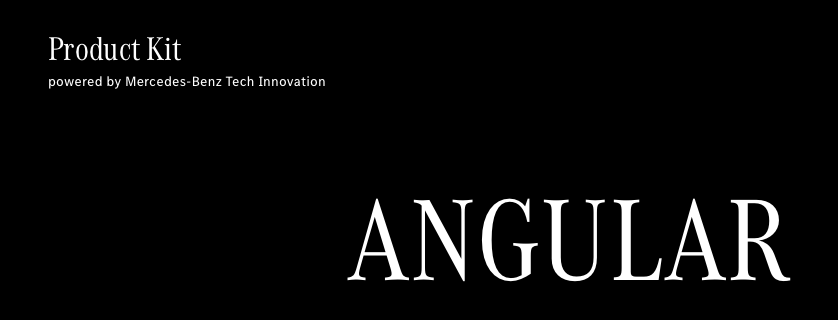

<!-- © Mercedes-Benz Tech Innovation GmbH --->
<!-- SPDX-License-Identifier: MIT --->


[](LICENSE)
[](https://www.npmjs.com/package/@daimler/productkit-angular)


Product Kit for Angular provides web components for Mercedes-Benz Tech Innovation web frontends based on Angular Material.

Feel free to open an [issue](https://github.com/mercedes-benz/product-kit_angular/issues) or provide a pull request with the desired modifications.

## Usage
*Note that you must have node (and npm) installed.*

Install the npm package from the root directory through:
```
npm install @daimler/productkit-angular --save-prod
```

Once installed, simply add the following import in your styles.scss, and you are good to go: 

```
@use '~@daimler/productkit-angular/src/theme/scss/styles';
```

Or use the following instead:

```
@import '~@daimler/productkit-angular/src/theme/scss/styles';
```

*For styling and theme to work in your project, Anglar Material must be installed as a dependency.*

Note: If your project already has styling or uses prebuilt-themes please update the angular.json 
and styling files to use styles from Product Kit for Angular.

## Contributing

We welcome any contributions.
If you want to contribute to this project, please read the [contributing guide](CONTRIBUTING.md).

## Code of Conduct

Please read our [Code of Conduct](https://github.com/mercedes-benz/foss/blob/master/CODE_OF_CONDUCT.md) as it is our base for interaction.

## License

This project is licensed under the [MIT LICENSE](LICENSE).

## Provider Information

Please visit <https://www.mercedes-benz-techinnovation.com/en/imprint/> for information on the provider.

Notice: Before you use the program in productive use, please take all necessary precautions,
e.g. testing and verifying the program with regard to your specific use.
The program was tested solely for our own use cases, which might differ from yours.
